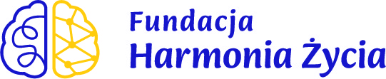
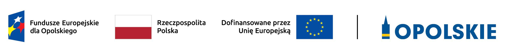

# Kompetencje cyfrowe i AI dla wolontariuszy

Program szkoleniowy przygotowujący 20 uczestników projektu (UP) w zakresie kompetencji
cyfrowych – w tym korzystania z narzędzi sztucznej inteligencji (AI), podstaw
programowania oraz narzędzi graficznych.

Warsztaty mają dwa cele:
1. rozwinięcie umiejętności cyfrowych samych uczestników,
2. przygotowanie ich do wspierania innych osób w nauce i wykorzystaniu tych kompetencji
   (wolontariusze jako multiplikatorzy).

## Struktura repozytorium

- `day-1/` – materiały pierwszego dnia warsztatów (25 lipca 2026): powitanie i cele
  programu, podstawy kompetencji cyfrowych (e-mail, chmura, ochrona danych osobowych),
  wprowadzenie do AI i unijnego AI Act. Zawiera prezentacje `dzien1_prezentacja.pptx`,
  `Kompetencje-cyfrowe.pptx` oraz `AI.pptx`.
- `day-2/` – materiały drugiego dnia warsztatów: narzędzia AI w praktyce. Zawiera
  prezentację wprowadzającą `day2-ai-intro.pptx`, wersję ćwiczeniową
  `day2-ai-tools-practise.pptx`, eksport `day2-ai-tools.pdf` oraz **zadania
  praktyczne do każdego narzędzia** (zob. tabela poniżej).
- `day-3/` – materiały trzeciego dnia warsztatów: grafika AI i wystąpienia publiczne
  (storytelling + Gamma.app). Zawiera `gamma-zadania/` (5 zadań rozgrzewkowych
  z narzędziem), `cwiczenie-3-scenariusze.md` (właściwe ćwiczenie dnia — 3
  scenariusze prezentacji zakończone 5-minutowym wystąpieniem na żywo) oraz
  `materialy/` z teorią storytellingu i przykładami (część plików jest
  lokalna-tylko, zob. `.gitignore`).
- `logo/` – grafiki i logotypy używane w materiałach programu.

Kolejne dni/moduły (programowanie, narzędzia graficzne) będą dodawane jako osobne foldery
w miarę rozwoju programu.

### Zadania praktyczne – Dzień 2

Każdy folder zawiera własny `README.md` z instrukcją logowania do narzędzia,
spisem zadań i wskazówką, które z nich wykonać na żywo, a które zostawić
uczestnikom do pracy własnej. **Wszystkie narzędzia są darmowe.**

| Folder | Narzędzie | Zakres zadań |
|--------|-----------|--------------|
| [`day-2/notebooklm-zadania/`](day-2/notebooklm-zadania/) | NotebookLM | wgrywanie źródeł, cytowania, podcast, mapa myśli, notatnik szkoleniowy |
| [`day-2/perplexity-zadania/`](day-2/perplexity-zadania/) | Perplexity | wyszukiwanie z cytowaniami, udostępnianie wątku, zapytania głosowe |
| [`day-2/elevenlabs-zadania/`](day-2/elevenlabs-zadania/) | ElevenLabs | synteza mowy, ustawienia głosu, etyka i deepfake głosowy |
| [`day-2/claude-zadania/`](day-2/claude-zadania/) | Claude | formuła P.K.Z.O., plany i limity, Connections, Skills, style pisania |
| [`day-2/gemini-zadania/`](day-2/gemini-zadania/) | Gemini + CLI | rozmowa i pliki, modele, Gemy, instalacja i praca w terminalu |
| [`day-2/designer-zadania/`](day-2/designer-zadania/) | Microsoft Designer | prompty graficzne, plakat z szablonu, edycja zdjęcia, prawa i oznaczanie AI |

Materiały źródłowe do ćwiczeń (zdrowy tryb życia, ergonomia pracy, przykładowy
regulamin BHP) znajdują się w
[`day-2/notebooklm-zadania/materialy/`](day-2/notebooklm-zadania/materialy/) i są
wykorzystywane także przez zadania z pozostałych narzędzi.

### Zadania praktyczne – Dzień 3

Dzień 3 skupia się na jednym narzędziu (Gamma.app) i praktycznym ćwiczeniu z
wystąpieniami publicznymi — struktura inna niż w Dniu 2, bo nie ma tu osobnego
folderu na każde narzędzie.

| Folder/plik | Zawartość |
|-------------|-----------|
| [`day-3/gamma-zadania/`](day-3/gamma-zadania/) | 5 zadań rozgrzewkowych: logowanie i pierwsza prezentacja, tryb „Paste in text", edycja i obrazy, styl/eksport/udostępnianie, oraz publikacja wydarzenia w Luma wraz z klauzulą RODO |
| [`day-3/cwiczenie-3-scenariusze.md`](day-3/cwiczenie-3-scenariusze.md) | Właściwe ćwiczenie dnia — uczestnik wybiera jeden z 3 scenariuszy (sprzedażowy, mowa konferencyjna, program compliance), przygotowuje 10-slajdową prezentację w Gammie i prezentuje ją na żywo w ok. 5 minut |
| [`day-3/materialy/`](day-3/materialy/) | Teoria storytellingu (framework DataPOV, 5 kroków, typy prezentacji) i gotowe przykłady/prompty — część plików jest dostępna tylko lokalnie (zob. `.gitignore`) |

Podobnie jak w Dniu 2: konto do narzędzia (gamma.app) warto założyć **przed**
szkoleniem — szczegóły w [`day-3/gamma-zadania/README.md`](day-3/gamma-zadania/README.md).

## Harmonogram szkolenia

Podróż po AI i kompetencjach cyfrowych – pełny program obejmuje 8 dni szkoleniowych:

| Dzień   | Data       | Temat                                                                    | Opis                                             |
|---------|------------|---------------------------------------------------------------------------|---------------------------------------------------|
| Dzień 1 | 25.07.2026 | Podstawy + AI Entry                                                       | Wprowadzenie do technologii i AI.                  |
| Dzień 2 | 01.08.2026 | Regulacje AI, Bezpieczeństwo AI, Narzędzia AI                             | Prawo, bezpieczeństwo i narzędzia AI.              |
| Dzień 3 | 05.09.2026 | Grafika AI i Wystąpienia Publiczne                                        | AI w wizualizacjach i prezentacjach.               |
| Dzień 4 | 19.09.2026 | Dźwięk, Filmy, Montaż z AI, Podstawianie Własnego Głosu AI                | AI w multimediach i głosie.                        |
| Dzień 5 | 26.09.2026 | Podstawy Programowania: Python, HTML, SQL, Hosting                        | Języki programowania i internet.                   |
| Dzień 6 | 17.10.2026 | Systemy AI, Agenci z n8n, RAG z n8n                                       | Zaawansowane systemy AI i automatyzacja.           |
| Dzień 7 | 24.10.2026 | Baza Wiedzy w Obsłudze, Formuła MD, Warsztaty z Bielik AI                 | Zarządzanie wiedzą i Bielik AI.                    |
| Dzień 8 | 07.11.2026 | Podsumowanie, Przekazanie Materiałów i Grupowy Projekt Końcowy            | Podsumowanie i projekt końcowy.                    |

## Agenda – Dzień 1

| Godziny       | Blok                             |
|---------------|----------------------------------|
| 8:00 – 9:30   | Blok 1: Powitanie i cele programu — przedstawienie, omówienie programu, ćwiczenie „speed dating" |
| 9:30 – 10:15  | Blok 2 (część 1): Podstawy kompetencji cyfrowych — e-mail, chmura obliczeniowa, ochrona danych |
| 10:15 – 10:25 | Przerwa kawowa                   |
| 10:25 – 11:10 | Blok 2 (część 2): Podstawy kompetencji cyfrowych — kontynuacja ćwiczeń praktycznych |
| 11:10 – 12:40 | Blok 3 (część 1): Wprowadzenie do AI — czym jest sztuczna inteligencja, jak działa i jak z niej korzystać |
| 12:40 – 12:55 | Przerwa obiadowa                 |
| 12:55 – 14:25 | Blok 3 (część 2): Wprowadzenie do AI — regulacje prawne UE (AI Act) i odpowiedzialne wykorzystanie AI |

Szczegóły materiałów do każdego bloku w [`day-1/README.md`](day-1/README.md).

## Agenda – Dzień 2

| Godziny       | Punkt programu                  |
|---------------|----------------------------------|
| 8:00 – 8:45   | Organizacja i podpisy            |
| 8:45 – 9:00   | Przerwa kawowa                   |
| 9:00 – 12:00  | Blok 1: Systemy AI                |
| 12:00 – 12:45 | Przerwa obiadowa                 |
| 12:45 – 13:45 | Blok 2: Regulacje AI              |
| 13:45 – 14:25 | Blok 3: Infrastruktura AI          |

## Agenda – Dzień 3

| Godziny       | Punkt programu                                          |
|---------------|-----------------------------------------------------------|
| 8:00 – 8:45   | Powtórka i regulacje AI                                    |
| 8:45 – 9:00   | Przerwa kawowa                                             |
| 9:00 – 10:00  | Blok 1: Storytelling i Gamma – teoria                      |
| 10:00 – 11:30 | Blok 2: Rozgrzewka z Gammą (zadania 1–5)                   |
| 11:30 – 12:15 | Przerwa obiadowa                                           |
| 12:15 – 13:15 | Blok 3: Ćwiczenie główne – wybór scenariusza i przygotowanie prezentacji |
| 13:15 – 14:25 | Blok 4: Prezentacje na żywo (ok. 5 min/osoba) + feedback   |

